# Brain Lab Architecture Diagrams

This document explains the current Brain Lab architecture using Mermaid diagrams.
It is meant to be read alongside `PROJECT_BRIEF.md`, `ROADMAP.md`, and
`ARCHITECTURE.md`.

Brain Lab is intentionally small. Each phase adds one concept at a time:

1. Store notes locally in SQLite.
2. Wrap note operations as tools.
3. Run a manual agent loop with a fake model.
4. Connect a local Ollama model to the same loop.

## System Map

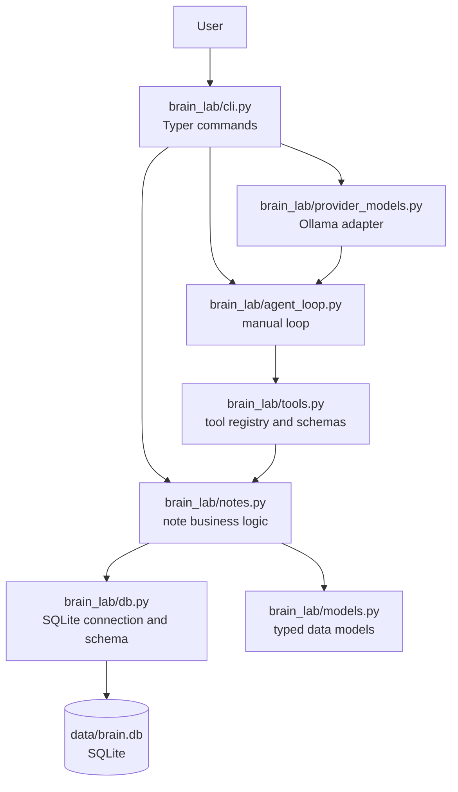

The CLI has two paths:

- `brain note ...` commands call `notes.py` directly.
- `brain ask ...` creates an Ollama model, then runs the manual agent loop.

The agent loop does not know about Ollama. It only knows that a model can return
either a final answer or tool calls.

## Module Responsibilities

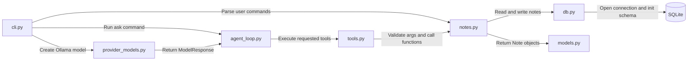

### `cli.py`

`cli.py` is the application entry point. It should stay thin:

- Parse command-line input.
- Call the correct application layer.
- Print user-facing output.
- Exit with a non-zero code for command failures.

It has two kinds of commands:

- `brain note ...` for direct note operations.
- `brain ask ...` for model-driven note operations through the agent loop.

### `db.py`

`db.py` owns SQLite details:

- The default database path.
- Creating parent directories.
- Opening SQLite connections.
- Creating the `notes` table.

Other modules should not build SQLite schemas themselves.

### `models.py`

`models.py` contains typed data returned by the business layer. Right now the main
model is `Note`.

### `notes.py`

`notes.py` is the business logic layer. It knows how to:

- Create notes.
- List notes.
- Get a note by ID.
- Update notes.
- Delete notes.
- Search note text and tags.

It does not know about Typer, tools, model providers, or MCP.

### `tools.py`

`tools.py` wraps note operations in tool definitions. Each tool has:

- A stable tool name.
- A short description.
- A Pydantic input schema.
- A Python function that executes the tool.

The important design rule is that model-controlled arguments are separate from
runtime context. For example, the model can choose a note title, but it does not
choose the local `db_path`.

### `agent_loop.py`

`agent_loop.py` owns the manual loop:

- Send messages to a model.
- Receive a final answer or tool calls.
- Execute tool calls through `tools.py`.
- Send tool observations back to the model.
- Stop when the model gives a final answer or `max_steps` is reached.

The fake model in this file makes the loop testable without network calls.

### `provider_models.py`

`provider_models.py` adapts Ollama's native chat API to Brain Lab's internal
model protocol. It converts local tools into Ollama tool schemas and parses
Ollama tool calls back into Brain Lab `ToolCall` objects.

## Direct Notes CLI Flow

This is the simplest path. The user explicitly chooses the note operation.

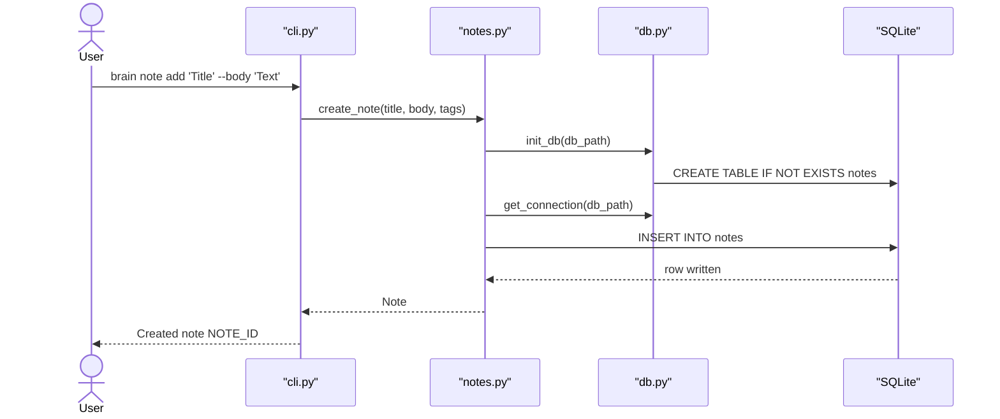

The direct CLI path is useful because it proves the local data layer works before
the agent layer exists.

## Tool Layer Flow

Tools are a small adapter around `notes.py`. They make the note operations
available to models later.

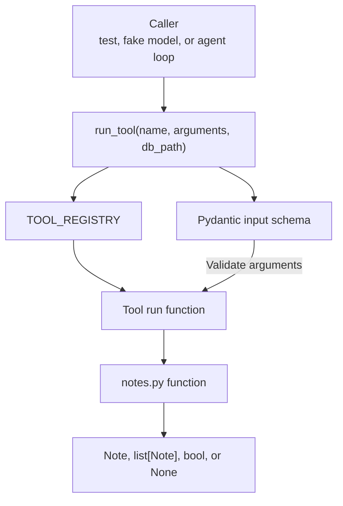

Example:

```python
run_tool(
    "create_note",
    {"title": "Tool layer", "body": "Wrap note operations."},
    db_path=db_path,
)
```

The model will eventually produce the tool name and JSON arguments. The local app
still controls the database path.

## Manual Agent Loop

The manual loop is the core learning object in the project. It shows the agent
pattern without hiding it behind a framework.

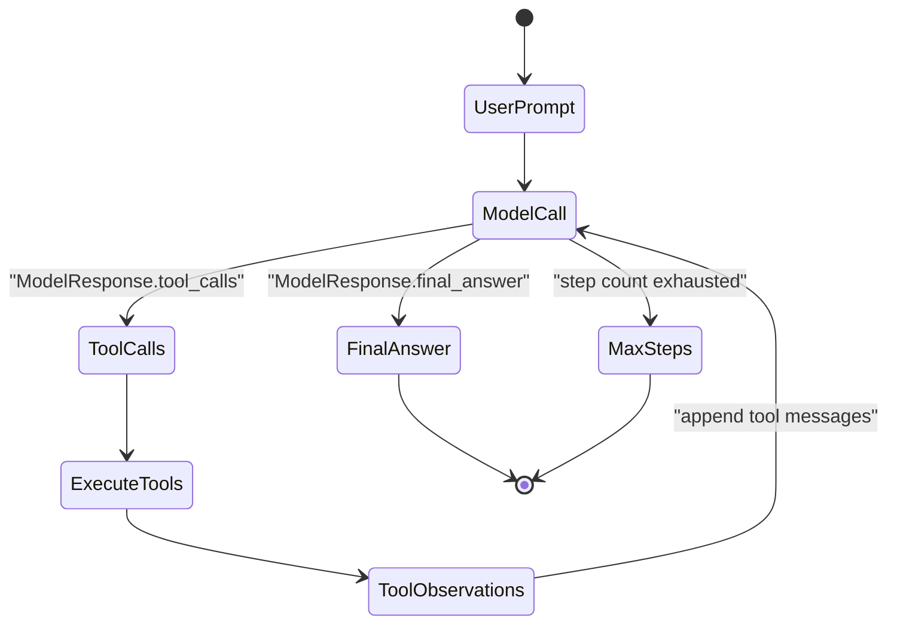

The loop has only two model response types:

- Final answer: return to the user.
- Tool calls: execute tools and continue.

Tool errors are not thrown out of the loop. They are recorded as tool observations
and sent back to the model so it can recover or explain the failure.

## Fake Model Flow

The fake model is deterministic. It does not understand text. It returns scripted
responses so tests can verify loop behavior.

```mermaid
sequenceDiagram
    participant Test as "test_agent_loop.py"
    participant Fake as "FakeModel"
    participant Loop as "run_agent"
    participant Tools as "tools.py"

    Test->>Fake: scripted responses
    Test->>Loop: run_agent(prompt, FakeModel)
    Loop->>Fake: respond(messages)
    Fake-->>Loop: call create_note
    Loop->>Tools: run_tool("create_note", args)
    Tools-->>Loop: Note
    Loop->>Fake: respond(messages + tool result)
    Fake-->>Loop: final answer
    Loop-->>Test: AgentRun
```

This is why Phase 3 can be tested without network calls.

## Ollama Adapter Flow

`brain ask` connects a local Ollama model to the same manual loop.

```mermaid
sequenceDiagram
    actor User
    participant CLI as "cli.py"
    participant Adapter as "provider_models.py"
    participant Loop as "agent_loop.py"
    participant API as "Ollama API"
    participant Tools as "tools.py"
    participant Notes as "notes.py"

    User->>CLI: brain ask "Create a note"
    CLI->>Adapter: OllamaModel(url, model)
    CLI->>Loop: run_agent(prompt, ollama_model)
    Loop->>Adapter: respond(messages)
    Adapter->>API: messages + Ollama tool schemas
    API-->>Adapter: Ollama tool call
    Adapter-->>Loop: ModelResponse(tool_calls)
    Loop->>Tools: run_tool(name, arguments)
    Tools->>Notes: create_note(...)
    Notes-->>Tools: Note
    Tools-->>Loop: result
    Loop->>Adapter: respond(messages + tool observation)
    Adapter->>API: tool result
    API-->>Adapter: final text
    Adapter-->>Loop: ModelResponse(final_answer)
    Loop-->>CLI: AgentRun
    CLI-->>User: final answer
```

The manual loop remains in charge. The Ollama adapter only translates between
Ollama API shapes and Brain Lab's internal `ModelResponse`.

## Ollama Adapter Shape

Brain Lab keeps one internal tool-call shape and translates at the Ollama
boundary.

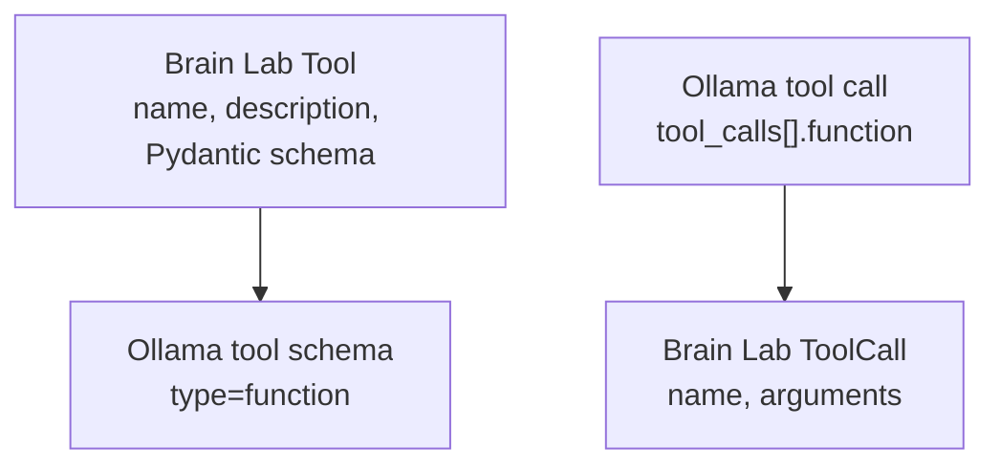

The adapter is intentionally small: HTTP transport, message formatting, tool
schema conversion, and response parsing live at the provider boundary.

## Data Model and Storage

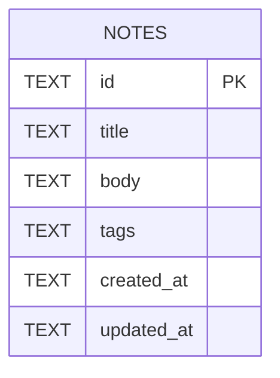

SQLite stores tags as comma-separated text. `notes.py` converts that text back
into `list[str]` when returning a `Note`.

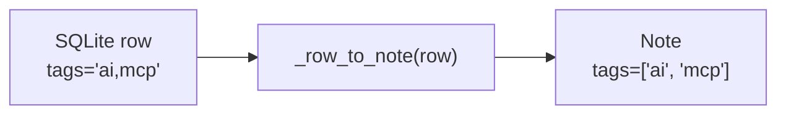

## Testing Map

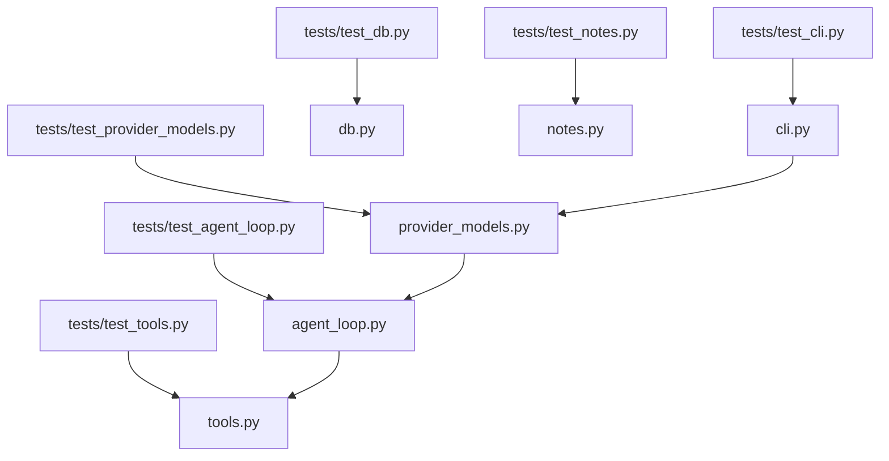

The tests mirror the architecture:

- Database tests prove the schema can be created.
- Notes tests prove local business behavior.
- Tool tests prove validation and registry behavior.
- Agent loop tests prove loop mechanics with a fake model.
- Adapter tests prove request and response translation without network calls.
- CLI tests prove command wiring and error handling.

## Current Phase Boundary

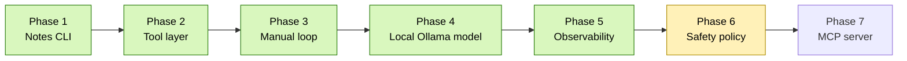

The current implementation reaches Phase 5:

- The local notes app works.
- Notes are exposed as tools.
- A manual agent loop can execute tool calls.
- The Ollama adapter can drive the same loop.
- Agent runs are logged to JSONL for inspection.

The next architectural layer is safety policy. That should classify tools by
risk without changing the core note business logic.

## Key Design Rules

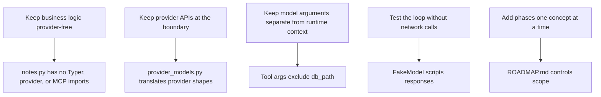

These rules are what keep Brain Lab readable as it grows.
